

  <table style="width:100%; border:none; background-color:transparent;">
    <tr>
      <td style="width:20%; text-align:left; border:none;">
        
      </td>
      <td style="width:60%; text-align:center; border:none;">
        <h2>TECNOLÓGICO NACIONAL DE MÉXICO</h2>
        <h3>INSTITUTO TECNOLÓGICO DE OAXACA</h3>
      </td>
      <td style="width:20%; text-align:right; border:none;">
        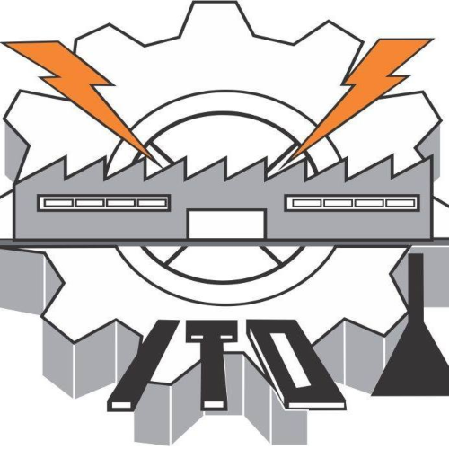
      </td>
    </tr>
  </table>
 

<b>CARRERA:</b>

  
INGENIERÍA EN SISTEMAS COMPUTACIONALES

 

<b>MATERIA:</b> PROGRAMACIÓN WEB

 

<b>PRESENTA:</b>

  
<b>MEIXUEIRO CRUZ ARTURO DANIEL</b>

 

<b>NOMBRE DEL CATEDRÁTICO:</b> MARTINEZ NIETO ADELINA

 

<b>ACTIVIDAD:</b> Portafolio Personal con Plantilla Bootstrap

  

  
07 DE JULIO DEL 2026

# Portafolio Personal 

La actividad pide tomar una plantilla de portafolio y modificarlo a nuestra forma para mostrar nuestra informacion, generar un curriculum que se pueda visualizar a travez de este portafolio con nuestros proyectos y lenguajes que conocemos asi como breves descripciones nuestras

## Descripción del Proyecto

Este portafolio fue desarrollado utilizando la plantilla PERSONAL de Start Bootstrap. El framework CSS utilizado es Bootstrap, el cual permite un diseño moderno, responsive y profesional.

### Secciones del Portafolio:
- Inicio: La portada del portafolio, con algo de informacion mia
- Currículum: Incluye los lenguajes que domino (por asi decirlo) y mis softskills
- Proyectos: Los proyectos a desarrollar (son 2 puesto que aun no me he decidido aaaa).
- Contacto: Formulario con uso de sweet alerts para evitar el uso de esas feas pantallas de arriba.

**Enlace de la plantilla original:**  
[https://startbootstrap.com/previews/personal](https://startbootstrap.com/previews/personal)

## Proceso de Creación

### 1. Página de Inicio
**Antes:**  
Contenido genérico con texto Start Bootstrap, foto placeholder y descripción de marketing. (olia a millas que es una planilla) 
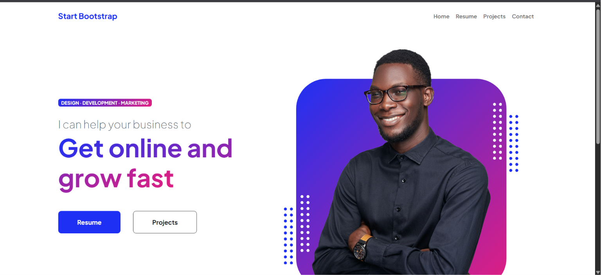

**Después:**  
Se personalizó el nombre, título, badge, foto de perfil y descripción propia.  
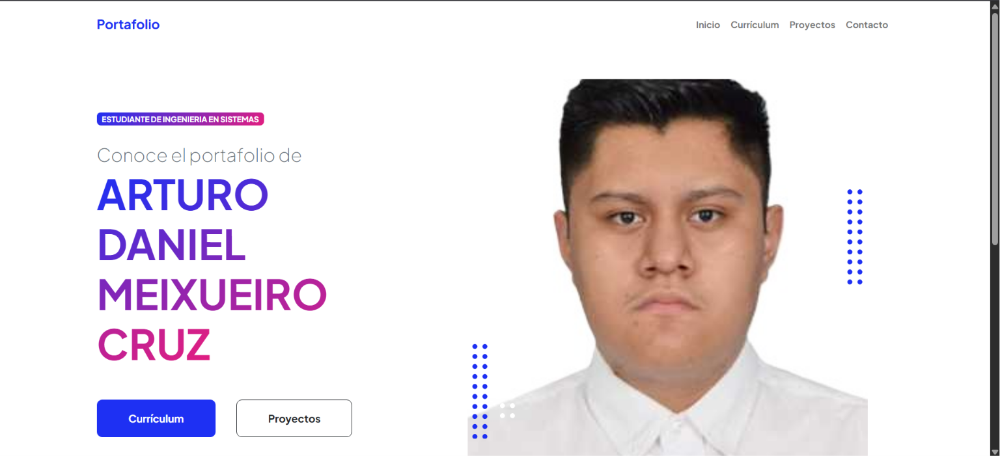

**Modificaciones:** Cambio de textos, reemplazo de imagen

### 2. Sección de Currículum
**Antes:**  
Tarjetas tradicionales de experiencia y educación con texto lorem ipsum.  
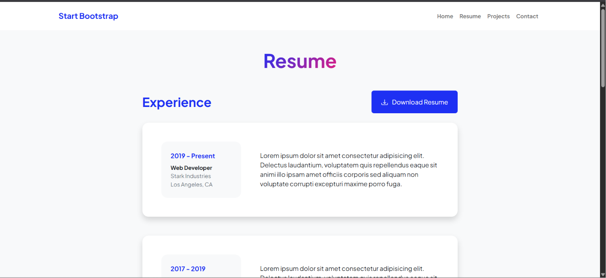

**Después:**  
Reemplazado por botones grandes que abren modales dinámicos mostrando lenguajes de programación y soft skills.  
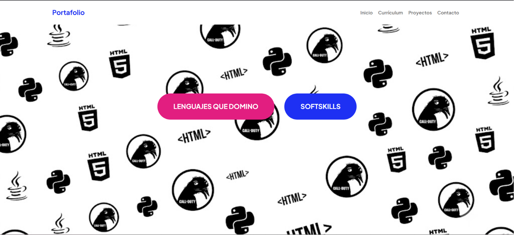

**Modificaciones:** Eliminación de contenido estático y creación de un js para todos los componentes visuales que quiera utilizar con estilos personalizados y fondo.

### 3. Sección de Proyectos
**Antes:**  
Dos tarjetas simples con imágenes x y texto placeholder.  
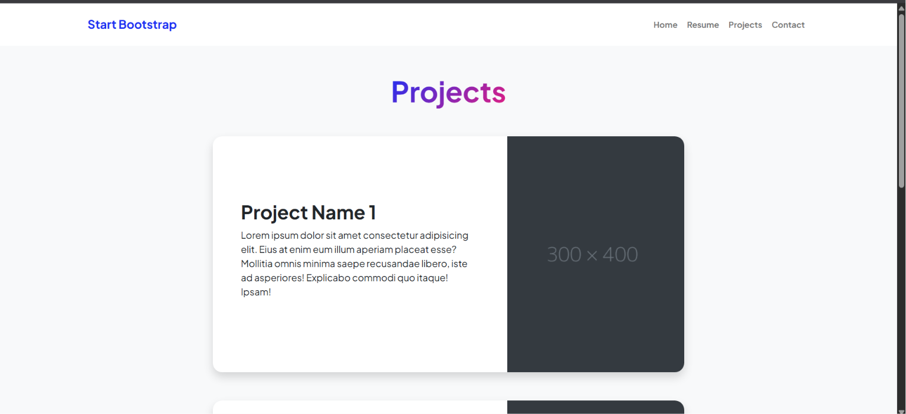

**Después:**  
Proyectos reales (`GUSTAMBO-PEDIA` y `GASTOMETRO.COM`) con carruseles de imágenes y fondo personalizado.  
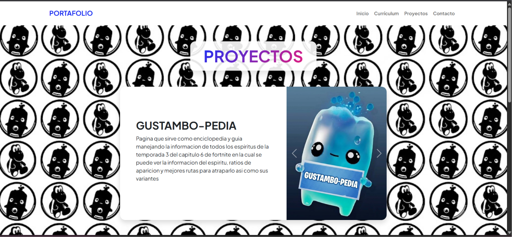

**Modificaciones:** Añadido carrusel Bootstrap, imágenes propias y estilos adicionales.

### 4. Sección de Contacto
**Antes:**  
Formulario básico con mensajes de éxito/error genéricos.  
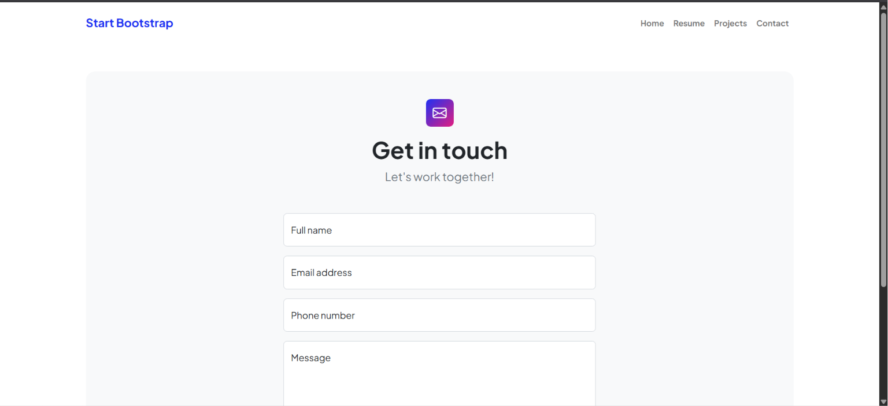

**Después:**  
Formulario en español con validación y mensajes usando SweetAlert.  
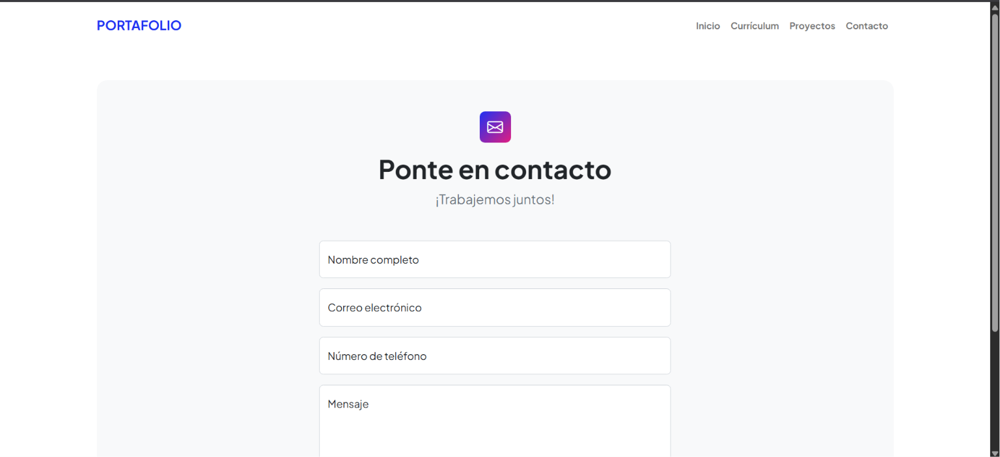

**Modificaciones:** Integración de SweetAlert, validación en JavaScript y mensajes personalizados.

### Modificaciones Técnicas Generales
- Cambio completo del idioma a español.
- Actualización de la barra de navegacion a uno acorde a lo que quiero presentar.
- Creación del archivo dynamic-components.js con clases DynamicModal, DynamicTooltip y DynamicCarousel.
- Añadidos fondos personalizados y efectos hover.
- Optimización de estilos adicionales en styles.css.

## Capturas de Pantalla

1. **Página de Inicio**  
   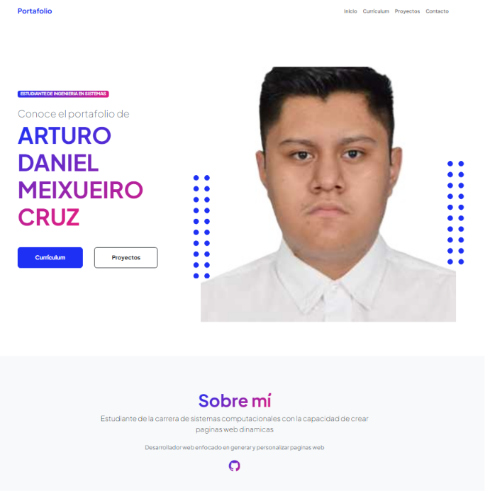

2. **Currículum con Modales**  
   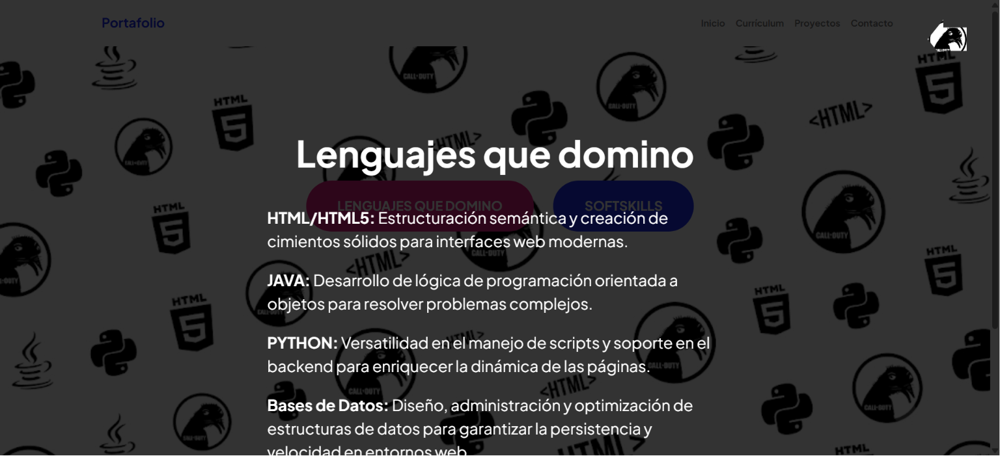
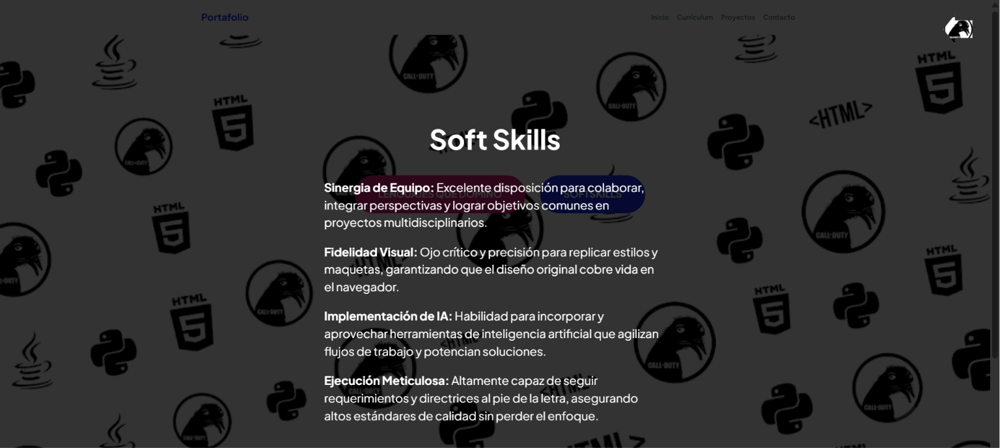

3. **Proyectos con Carruseles**  
   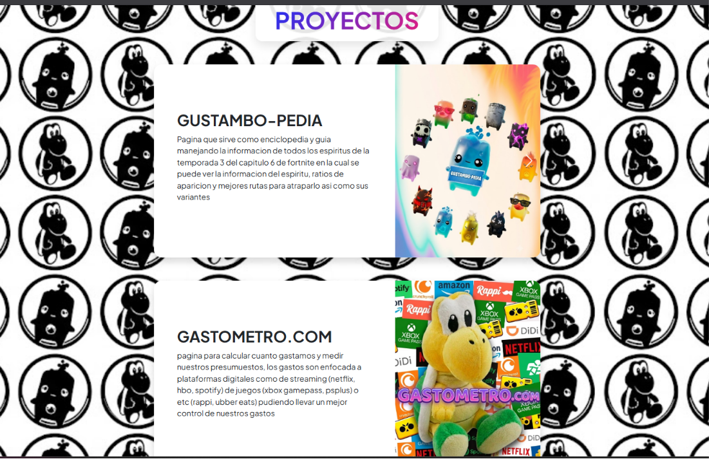

4. **Formulario de Contacto**  
   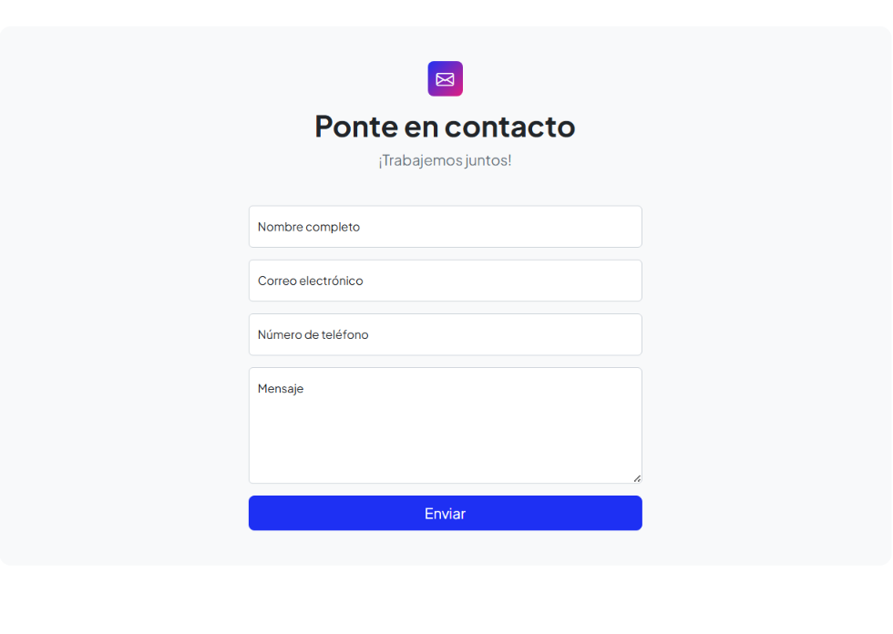

